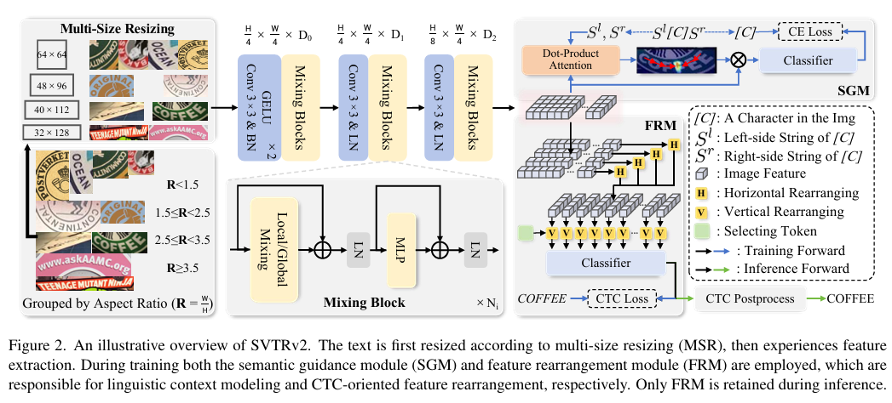
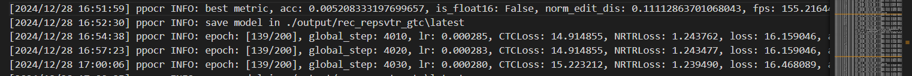
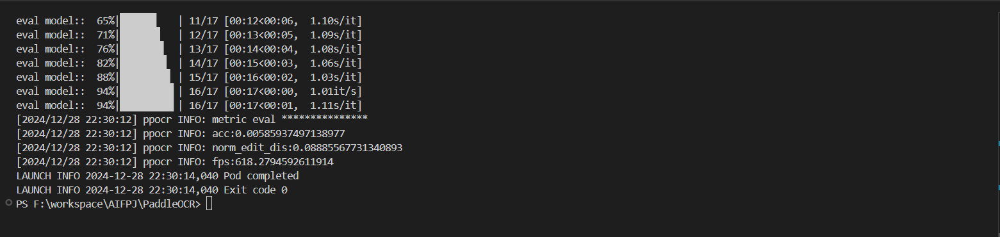
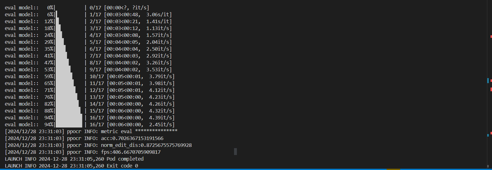
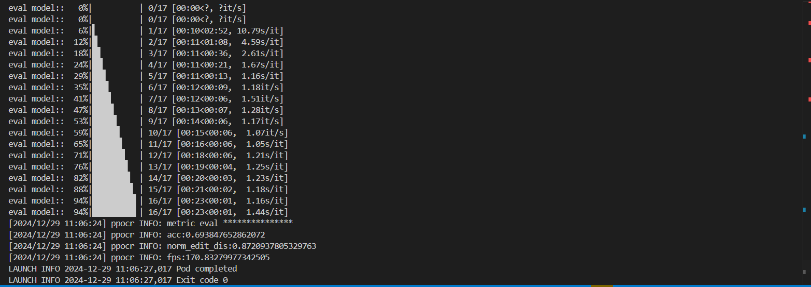
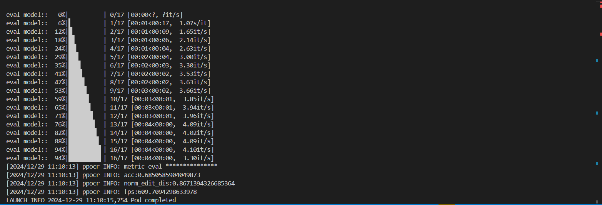
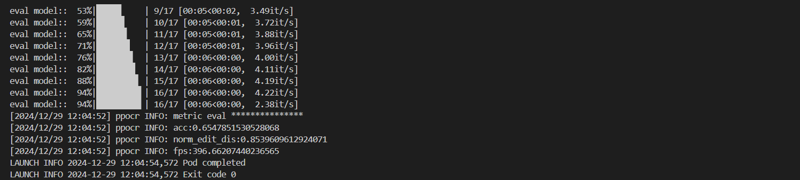

# 复现报告
[TOC]
## CRNN复现

### CRNN结构
* 卷积层
提取输入图像的特征，生成具有空间信息的特征图，用于捕捉字符的局部模式。

* 序列层
使用双向LSTM等循环神经网络，将卷积特征映射为序列特征，学习字符间的上下文依赖关系。

* 转录层
基于CTC（Connectionist Temporal Classification）损失，将序列特征解码为输出文本，解决不规则长度输入与输出的对齐问题。
### 代码
**见CRNN目录**
* config : 模型训练参数 模型参数定义
* CRNN : 模型框架，包含CNN和LSTM层
* dataset ： 数据集类,将图片转为灰度图
* train ： 包含训练 测试的方法
* ctc_decoder : 转录层代码，执行decode
* evalute：评估代码
* predict : 预测结果输出方法

### 踩坑

1. 数据清洗：数据格式不一致，需要修改，并且需要消除空格，空格的出现容易导致inf的loss导致nan
2. 转录层和前面lstm的衔接较为复杂


### 训练
* 具体参数设置见config
* 采用torch自带的C
* 训练过程采用tensorboard记录，见runs目录
* 每五个epoch进行一次eval，以便保存最优结果


### 测试
* 最优结果


## SVTRv2复现

**基于PaddleOCR框架进行训练与测试**
### RepSVTR模型架构理解


#### MSR（多尺寸重采样）

传统方法通常将不规则文本图像调整为固定大小（如32×128），可能导致失真，影响特征提取。为了解决这个问题，提出了**多尺寸重采样（MSR）**策略，该策略根据图像纵横比（\( R = \frac{W}{H} \)）来调整图像大小，具体包括四种尺寸：

- **[64, 64]**：当 \( R < 1.5 \) 时。
- **[48, 96]**：当 \( 1.5 \leq R < 2.5 \) 时。
- **[40, 112]**：当 \( 2.5 \leq R < 3.5 \) 时。
- **[32, ⌊R⌋×32]**：当 \( R \geq 3.5 \) 时。

这种方法确保文本图像根据纵横比自适应调整，避免了显著的失真。

#### 视觉特征提取

**SVTRv2** 网络架构借鉴了 **SVTR** 模型，分为三个阶段，每个阶段包含多个混合模块。为了提取判别性特征，模型设计了两种混合模块：

1. **局部混合**：通过连续的分组卷积捕捉局部字符特征，如边缘和笔画。
2. **全局混合**：通过多头自注意力（MHSA）机制建模全局上下文，增强对字符间关系和整体文本的理解。

这种结合局部卷积和全局自注意力的设计，有效提升了文本图像的特征提取能力，并且可以根据需求调整超参数。
#### 特征重排列模块（FRM）

为了解决旋转文本导致的 CTC 对齐问题，提出了 **FRM** 模块。该模块将 2D 特征 \( F \) 重排列成与文本图像阅读顺序同步的特征序列 \( \tilde{F} \)，从而改善对齐效果。
有两种重排列方式
1. **水平重排列**：通过学习水平重排列矩阵 \( M_h^i \)，调整每行特征，得到水平排列后的特征 \( F_h \)。
2. **垂直重排列**：通过选择标记 \( T_s \)，学习垂直重排列矩阵 \( M_v^j \)，对每列特征进行重新排列，最终得到规范化的特征序列 \( F_v \)。

通过这种水平和垂直的重排列方式，FRM 能有效处理旋转和不规则文本，从而为 CTC 分类提供更精确的对齐。
#### **语义引导模块（SGM）** 

传统的 CTC 模型直接通过视觉特征进行分类，要求语言上下文也融入其中。为此，提出了 **语义引导模块（SGM）**，通过将字符左右的上下文信息引导到视觉特征中，增强 CTC 模型的准确性。

* 过程：
  1. **左侧上下文处理**：将字符左侧的字符串映射为嵌入向量，经过编码生成隐藏表示 \( Q_l^i \)。
  2. **计算注意力图**：通过点积计算注意力图 \( A_l^i \)，并加权视觉特征 \( F \) 得到与目标字符相关的特征 \( F_l^i \)。
  3. **分类与损失**：将加权后的特征输入分类器，计算交叉熵损失。

* 作用：
    SGM通过将语言上下文融入视觉特征，提升 CTC 模型的性能，即使在推理时没有使用 SGM，也能维持上下文信息，增强准确性。

* 对比：
    与其他方法不同，SGM直接将上下文信息融入视觉特征，而不依赖解码器，适用于 CTC 模型。
####  **优化目标** 

在训练过程中，优化目标是最小化总损失 \( L \)，该损失由 **CTC 损失（Lctc）** 和 **SGM 损失（Lsgm）** 组成，公式如下：

\[
L_{ctc} = \text{CTCLoss}(\tilde{Y}_{ctc}, Y)
\]
\[
L_{sgm} = \frac{1}{2L} \sum_{i=1}^{L} \left( \text{ce}(\tilde{Y}_l^i, c_i) + \text{ce}(\tilde{Y}_r^i, c_i) \right)
\]
\[
L = \lambda_1 L_{ctc} + \lambda_2 L_{sgm}
\]

其中，\( \text{ce} \) 代表交叉熵损失，\( \lambda_1 \) 和 \( \lambda_2 \) 分别为 0.1 和 1 的权重系数。


### 数据集处理
* 将train集合按1：9的比例分割为valid集和train集
* 在训练时使用valid集进行测试


### 使用RepSVTR模型训练
* 此处没有采用预训练模型，而是直接使用RepSVTR的模型架构在数据集上进行训练
#### 第一次训练
* 训练参数为默认参数
* 训练150epoch，在RTX 3050上运行
* 使用paddlepaddle进行训练
```bash
python3 tools/train.py -c configs/rec/SVTRv2/rec_repsvtr_gtc.yml
```

**在139个epoch 终于突破了 0.0的acc 高达0.005**


**基于test集合的计算结果 acc=0.0053**

loss的下降太缓慢了 同时由于算力限制 很难跑过多epoch

所以我计划使用预训练模型进行训练，以获取更高的准确度

#### 第二次训练
**本次训练将训练参数完全设置为论文中的参数**
>  We use AdamW optimizer [30] with a weight decay of
 0.05 for training. The LR is set to 6.5×10−4 and batchsize
 is set to 1024. One cycle LR scheduler [43] with 1.5/4.5
 epochs linear warm-up is used in all the 20/100 epochs,
 where a/b means a for English and b for Chinese. For En
glish model, we take SVTRv2 without SGM as the pre
trained and fine-tuned SVTRv2 with SGM with the same
 above settings. Word accuracy is used as the evaluation met
ric. Data augmentation like rotation, perspective distortion,
 motion blur and gaussian noise, are randomly performed
 and the maximum text length is set to 25 during training.
 The size of the character set Nc is set to 94 for English
 and 6624 [28] for Chinese. In experiments, SVTRv2 means
 SVTRv2-B unless specified. All models are trained with
 mixed-precision on 4 RTX 4090 GPUs.


### 使用预训练模型进行训练
**baseline:基于openatom_rec_repsvtr_ch_train的预训练模型在未微调之前的结果**



#### 第一次训练
* 参数设置 见 rec_repsvtr_ch-fineturn-1.yml
  * 训练周期：20epoch
  * lr:0.0001
* 训练结果 acc=0.69

可以看到在20个epoch之后模型的准确度不升反降，说明模型过拟合到了训练集上，有可能是学习率过高，或者是迭代次数过多，对以上做出调整

* 一下为第10个epoch导出模型的训练效果


#### 第二次训练
降低训练epoch和lr后 仍然没有看到提升

以上情况说明预训练模型已经在相关数据集上进行过训练了，并且拟合程度较好，一但再训练就会过拟合到训练集上，降低准确度


## 总结

### 总结

本次实验复现了CRNN和SVTRv2模型：

1. **CRNN**：模型轻量高效，在常规场景下表现稳定，但在复杂背景和扭曲文本识别上表现有限。  
2. **RepSVTR**：通过MSR、FRM和SGM等模块显著提升了对复杂文本的适应能力。使用预训练模型加速了训练并提高了精度。  

实验结果 ：
**acc**
* CRNN : 
* RepSVTR:**70.2%**(预训练模型)；**经过微调后效果变差**